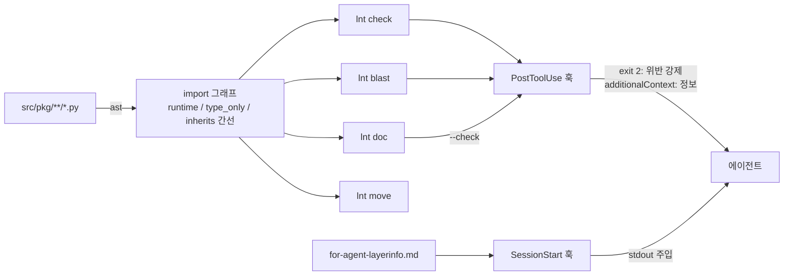
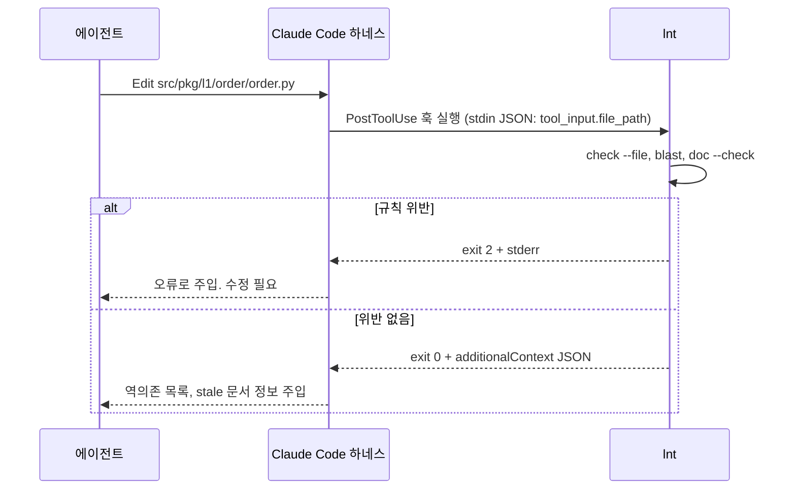

# ln-structure 개선 계획 (graft 흡수)

작성일: 2026-09-15
대상 저장소: `C:\Projects\ff_coding_agent_protocol_md` (init-protocol 스킬의 SOURCE)
도구 저장소: `C:\Projects\ff-lntools`

## 1. 목표

ln-structure의 수동 부분(층 배정, 규칙 검사, 시그니처 문서, 영향 범위)을 도구화하고
Claude Code 훅으로 세션에 강제 주입한다. graft를 도입하지 않고, ln-structure의
단방향 의존 특성을 이용해 더 단순한 전용 도구를 만든다.

## 2. 문제와 원인

| ID | 문제 | 원인 |
|---|---|---|
| P1 | 층 배정이 수동. 잘못 놓여도 모름 | 계산 도구 없음 |
| P2 | import 규칙(하위만, 표면만) 위반 감지 불가 | 검사 도구 없음 |
| P3 | 의존성 추가 시 층 이동 연쇄. 층 경로 import 깨짐 | 이동 도구 없음 |
| P4 | layerinfo-ln(시그니처)을 사람이 관리 | 생성 도구 없음 |
| P5 | moduleinfo가 낡아도 판정 불가 | 소스 hash 미기록 |
| P6 | 문서가 자동으로 읽히지 않음 | 세션 주입 없음 |
| P7 | 편집 후 영향 범위를 에이전트가 모름 | 역방향 그래프 없음 |
| P8 | 층 `__init__` 전체 re-export 로드 비용 | 프로토콜 규칙 |
| P9 | 상호 호출, 플러그인 등 규정 없음 | 프로토콜 누락 |

P1, P2, P3, P4, P7은 같은 원인(기계적으로 계산 가능한 정보를 사람이 관리)이며
import 그래프 하나로 함께 풀린다.

## 3. 구조





## 4. 도구 `ff-lntools`

- 패키지 `ff-lntools`, 모듈 `lntools`, CLI `lnt` (`ln`은 유닉스 명령과 충돌)
- ln-structure로 개발. 자기 자신을 검사한다
- Python 표준 라이브러리만 사용 (ast, pathlib, json, hashlib)
- py310, py312 양쪽에 설치. 훅은 `python -m lntools ...`로 호출

```
src/lntools/
  l0/  model     # Module, Edge(kind: runtime|type_only|inherits), Layer
  l1/  scanner   # 디렉토리 -> 모듈 목록. ast로 import, 상속, TYPE_CHECKING 수집
  l2/  graph     # 그래프. 계산 층, 역의존, 상속 경유 소비자
  l3/  check     # C1~C4 -> 위반 목록
  l3/  blast     # 역의존 출력
  l3/  doc       # 시그니처 추출, 마커 영역 생성/비교, hash stamp
  l4/  hook      # stdin JSON, 채널 선택
  l4/  move      # 폴더 이동 + import 재작성
  l5/  cli       # 진입점
tests/           # 미러. fixtures/에 위반이 심어진 샘플 프로젝트
```

### 검사 항목

- C1 방향: import 대상 층 < 자기 층. type_only 간선 포함
- C2 표면: `pkg.lK.module` 또는 `pkg.lK`까지만. 중첩 모듈 내부 진입 금지
- C3 층 일치: 계산 층(의존 최고 층 + 1, 의존 없으면 0) == 선언 층
- C4 순환: 모듈 간 runtime 순환 금지. 모듈 내부 파일 간 순환은 규칙 밖

### 훅

```json
{
  "hooks": {
    "SessionStart": [{
      "matcher": "startup|resume|clear|compact",
      "hooks": [{"type": "command", "command": "python -m lntools hook session-start"}]
    }],
    "PostToolUse": [{
      "matcher": "Edit|Write|MultiEdit",
      "hooks": [{"type": "command", "command": "python -m lntools hook post-edit", "timeout": 30}]
    }]
  }
}
```

- session-start: `src/<pkg>/for-agent-layerinfo.md`를 stdout으로 출력
- post-edit: `file_path`가 `src/**/*.py`가 아니면 exit 0. 위반 있으면 exit 2 + stderr.
  없으면 blast, doc --check 결과를 `hookSpecificOutput.additionalContext`로 출력
- UserPromptSubmit 주입은 하지 않는다 (소음)

## 5. 단계

진행 상태 (2026-09-15): 0~5 완료. 테스트 34건 통과, 자기 검사 위반 0.
추가: `lnt init` 으로 코딩 프로토콜을 패키지에 포함해 배포 단위를 pip 하나로 통합. 6(실적용, taskforce) 진행 중.

| 단계 | 내용 | 검증 |
|---|---|---|
| 0 | 프로토콜 텍스트 수정 (아래 6장) | 문서 리뷰 |
| 1 | `lnt check`, `lnt blast` | fixture에서 위반 4종 검출. lntools 자기 검사 통과 |
| 2 | 훅 2개 + init-protocol 스킬에 settings 병합 | 실제 세션에서 exit 2, additionalContext 확인 |
| 3 | `lnt doc` 생성 + `--check` | fixture 생성 결과 == 기대 문서. 시그니처 변경 후 exit 1 |
| 4 | `lnt doc --stamp`, stale 판정 | hash 불일치 시 post-edit 컨텍스트에 표시 |
| 5 | `lnt move` | 이동 후 check, 테스트 통과 |
| 6 | 소형 프로젝트 1개에 실적용 | 실사용 |

1~2가 최소 유효 단위. 0을 먼저 끝내고 1로 진행.

## 6. 프로토콜 텍스트 수정 (단계 0)

- `for-agent-codingprotocol-ln-structure.md`
  - 하위가 상위를 호출해야 할 때 3갈래: 층 올리기 / 1:1이면 한 모듈로 합침 / 1:N 또는 패키지 외부면 의존성 역전
  - 모듈 내부 파일 간 순환은 허용. Python 순환 import는 `TYPE_CHECKING`으로
  - 역전 규칙: 인터페이스는 양쪽보다 낮은 층, 구현체는 명시 상속 + `@override`, 연결은 최상위에서만, import 시점 등록 금지
  - 최상위 연결 모듈은 1파일 1클래스 예외
  - 층 `__init__`는 PEP 562 `__getattr__` lazy re-export
- `for-agent-layerinfo-template.md`, `for-agent-layerinfo-ln-template.md`: 생성 영역 마커
- `for-agent-moduleinfo-template.md`: `sources` 헤더
- `for-agent-codingprotocol-python.md`: `typing_extensions.override` (3.10) / `typing.override` (3.12)

## 7. 범위 밖

- LLM 요약 노드, 프롬프트별 노드 주입, 함수 단위 호출 그래프, 다언어
- 기존 40개 프로젝트 일괄 재적용 (단계 6 이후 별도)
